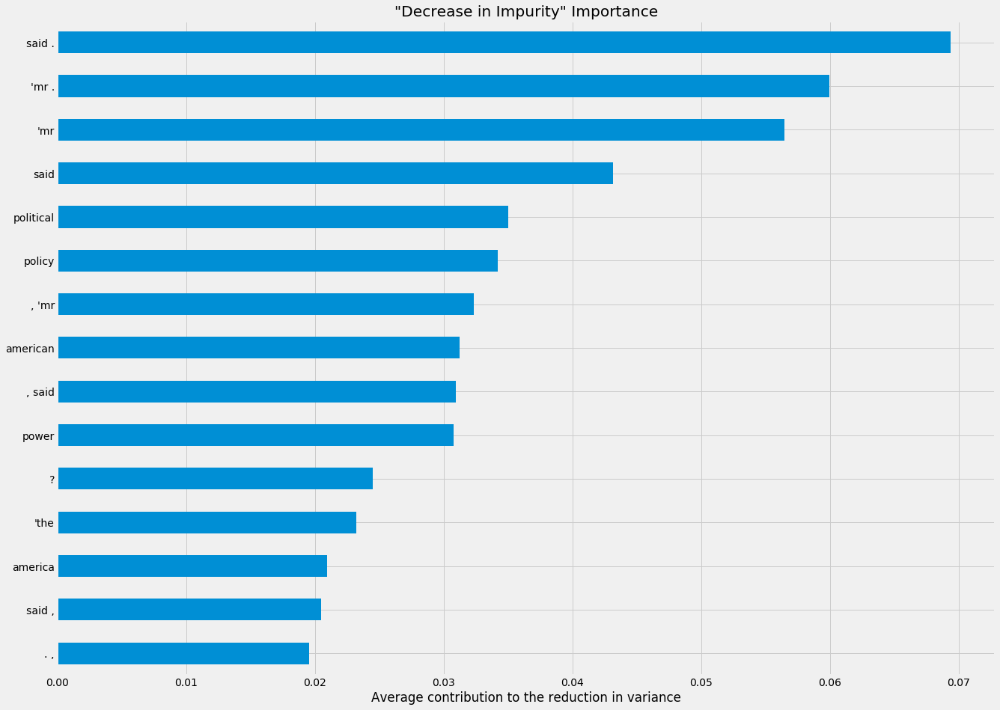

# Classifying "Op-Ed" vs "News"

## Background:
##### Format matters. As the modern consumer is bombarded with news and opionion from multiple sources via multiple formats it is becoming increasingly difficult for a consumer to distinguish what they should take as fact from what they should take as opinion by design.

###### I was interested in buildilng a model that classified stories written for the "Op-Ed" desk and those written for the "News" desk, the two formats that coexist in every news room, print or broadcast.

## Objectives:

###### 1. Build a classification model that predicts "Op-Ed" from "News" pieces using NLP on the body of the articles themselves.
###### 2. Feature engeineer data sets that control for topic to discover features that differenciate bias in a specific topic. (eg. classfiying politcal Op-Ed from news stories about polciatics. 
###### 3. Build a [XGBoost](https://xgboost.readthedocs.io/en/latest/#)

